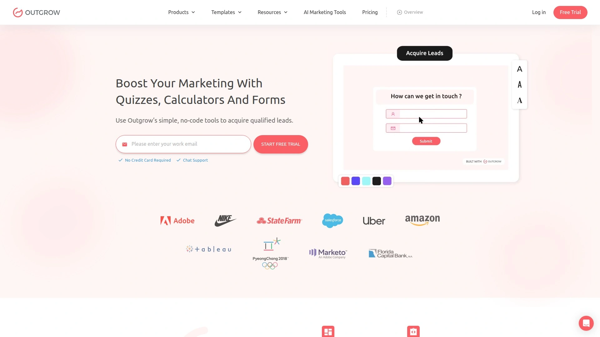
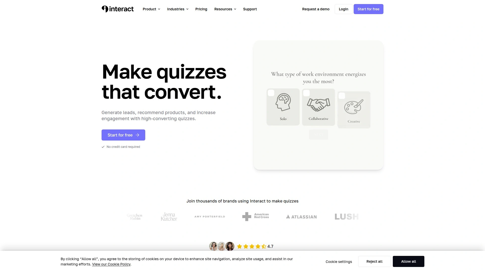

# 2025's Top 10 Best Interactive Content Platforms

Standing out online feels harder every year. Static blog posts and basic landing pages disappear into the noise while your competitors grab all the attention. Interactive content—quizzes, calculators, assessments, and surveys—changes that equation completely. These platforms let you build experiences that pull visitors in, qualify leads automatically, and deliver personalized recommendations without hiring developers. Smart marketers now see conversion rates jump 3-5x compared to traditional forms, plus they collect richer data about what customers actually want.

## **[Outgrow](https://outgrow.co)**

No-code builder with AI-powered suggestions for instant results.

This platform specializes in calculators and quizzes that actually convert. The dashboard offers AI suggestions that generate content based on your goals and keywords, cutting creation time from hours to minutes. The system produces headings, questions, and relevant background images automatically, though you maintain full control to edit anything.

Over 300 professionally designed templates cover multiple industries, from B2B lead qualification to e-commerce product recommendations. The drag-and-drop editor handles complex branching logic without requiring technical knowledge. Users consistently mention the clean interface—even beginners navigate it comfortably after a brief learning period.

Analytics go deeper than basic metrics. You get performance recommendations that show exactly how to optimize each campaign, with the platform encouraging you toward 100% efficiency through simple improvements. Real-time data tracking shows which questions work, where people drop off, and what results generate the most engagement.

Integration capabilities connect with every major marketing tool through webhooks and native connections. Customer support responds quickly across all plan levels including the free tier, with live chat answering questions in minutes. For marketers prioritizing lead quality over quantity, this platform delivers measurable improvements to conversion rates.

## **[Typeform](https://www.typeform.com)**

Conversational interface that treats forms like human conversations.

The one-question-at-a-time approach makes completing surveys feel natural rather than overwhelming. This format reportedly achieves 65% higher completion rates compared to traditional multi-question pages. Fortune 500 companies trust the platform—65% of them build forms here.

Creating quizzes works through either the visual builder or AI-powered tools that craft engaging questions automatically. You choose between outcome quizzes that assign answers to specific endings, or score quizzes that tally points and deliver results based on ranges. The outcome format works perfectly for personality tests and product recommendations, while scoring fits knowledge assessments.

Twenty-eight different question types give you flexibility for any scenario. Picture choice questions narrow product options visually, multiple choice challenges trivia knowledge, and rating scales measure satisfaction levels. Logic branching shows respondents only relevant questions based on previous answers.

The mobile experience matches desktop quality, with forms rendering beautifully on any screen size. Embedding options let you add forms to websites, share via direct links, or post on social media. Integration with email marketing tools, CRMs, and analytics platforms happens through native connections.

## **[Interact](https://www.tryinteract.com)**

Quiz-focused platform engineered specifically for lead capture.

Case studies show impressive numbers—companies achieving 78% opt-in rates for email signups, generating 2,500 qualified leads from single quizzes, and improving conversion by 55.8%. These results come from design choices that prioritize conversion throughout the user experience.

The template library includes 800+ pre-made options across 40 categories. You select personality, scored, or assessment quiz types depending on your goals. All templates are fully customizable to match your branding, from colors and fonts to images and messaging.

Branching logic capabilities stand out as particularly powerful. The visual logic editor shows exactly how different answer paths lead to specific outcomes, making complex quiz flows easy to visualize and adjust. You create multiple answer paths, image questions, and conditional results without touching code.

Direct integration with email marketing tools means leads flow automatically into your sequences. Data exports via CSV give you complete control over collected information. The platform maintains full GDPR compliance, important for businesses operating internationally. Training support and a community of 600+ members help you master best practices.

## **[Involve.me](https://www.involve.me)**

Versatile builder handling everything from quizzes to payment forms.

This platform earns recognition as one of the easiest-to-use options while maintaining powerful capabilities. Beyond quizzes, you build calculators, payment forms, surveys, and complete landing pages from one interface. The flexible design system lets you customize layouts extensively rather than following rigid templates.

AI functionality generates complete funnels from simple prompts. You provide basic instructions, and the system creates quiz questions, layout designs, and logic flows automatically. Manual adjustments remain easy through the visual editor.

The scoring system allows negative values, giving you precise control over result calculations. If certain conditions should prevent specific outcomes, negative scores accomplish that automatically. Conditional logic jumps let you skip questions or show results based on previous inputs.

Integration options connect with Mailchimp, Discord, ConvertKit, Klaviyo, and Google Analytics without custom coding. Published projects can be shared via links, embedded in websites, or displayed as pop-ups. The free-forever plan makes testing risk-free before upgrading.

## **[Jotform](https://www.jotform.com)**

Comprehensive form builder with robust survey capabilities.

The platform handles simple contact forms through complex multi-step surveys with equal competence. Over 10,000 templates cover every use case—customer satisfaction surveys, employee feedback forms, market research questionnaires, and event registrations.

Two layout options accommodate different needs: classic forms display all questions on one page for quick completion, while card forms show one question per page to increase engagement and reduce abandonment. Mobile optimization ensures forms work flawlessly on smartphones and tablets.

Conditional logic creates personalized experiences by hiding and revealing questions based on previous responses. Question types include multiple choice, rating scales, text boxes, dropdowns, matrix tables, and star ratings. For customer satisfaction work, built-in NPS fields and scoring systems track loyalty metrics.

Analysis tools visualize data through charts and reports without exporting to external software. You monitor traffic, submission stats, and conversion rates directly in the dashboard. Report Builder transforms raw data into visual presentations for stakeholders. SMS survey capabilities extend reach to audiences preferring text-based interactions.

## **[Woorise](https://woorise.com)**

All-in-one lead generation platform for contests and interactive campaigns.

The interface resembles WordPress, making it familiar for users experienced with that platform. You create quizzes, surveys, forms, contests, giveaways, polls, and landing pages from one builder. The drag-and-drop system handles everything from simple forms to complex multi-action campaigns.

Product recommendation quizzes stand out as particularly valuable for e-commerce. You ask visitors questions about preferences and lifestyle, then use conditional logic to serve personalized product suggestions based on answers. Email notifications deliver these recommendations automatically, encouraging signups while guiding purchasing decisions.

Templates cover seasonal promotions, prize polls, trivia contests, personality quizzes, and lead generation pages. All designs are mobile-responsive and professionally styled. Conditional logic and merge tags personalize email notifications for each participant based on their entries.

Client workspace features make this ideal for agencies managing multiple brands. You set up separate areas for each client, add team members with specific roles, and keep campaigns organized. Language settings support over 100 options, crucial for international campaigns.

## **[SurveyMonkey](https://www.surveymonkey.com)**

Enterprise-grade survey platform with advanced analytics.

The drag-and-drop builder works for users at any technical level. Pre-designed templates tailored to different industries and needs accelerate survey creation. Question types extend beyond basics to include matrix ratings, ranking questions, A/B testing options, and image-based choices.

Logic branching ensures respondents see only relevant questions, improving data accuracy. Advanced analytics provide deep insights through custom reports, data segmentation, filtering, text analysis, and sentiment analysis. Cross-tabulation and trend analysis support complex evaluations beyond surface-level feedback.

Customization options maintain brand consistency through custom logos, color schemes, fonts, and themes. Skip logic, question piping, and display conditions create sophisticated survey experiences. Distribution happens through email, web links, social media, and website embeds.

Real-time response viewing provides immediate insights as data arrives. Export options include CSV, PDF, and XLS formats for external analysis. Enterprise features cover team collaboration tools, secure data handling, and integration with Salesforce, MailChimp, and Google Analytics. Security includes industry-standard encryption and compliance with GDPR and HIPAA regulations.

## **[Google Forms](https://workspace.google.com/products/forms/)**

Free solution integrated with Google Workspace ecosystem.

Zero cost makes this accessible for individuals, nonprofits, and budget-conscious organizations. Forms automatically save to Google Drive, with responses feeding into Google Sheets for analysis. The straightforward interface requires minimal learning—most users create their first survey within minutes.

Question types cover multiple choice, checkboxes, short answer, paragraph text, dropdown, linear scale, and date fields. You add sections to organize longer surveys, include images and videos for context, and require certain questions. Themes and colors customize appearance to match branding needs.

Real-time collaboration lets teams work simultaneously on form design. The response summary provides automatic charts and graphs visualizing results. Individual response review shows exactly what each person submitted.

Sharing works through direct links, email invitations, or embedding on websites. Form validation ensures data quality by restricting answer formats—email addresses, numbers within ranges, or text matching patterns. Quiz features assign point values and provide instant feedback for educational assessments.

## **[Formstack](https://www.formstack.com)**

Secure form builder focused on workflow automation.

The no-code, drag-and-drop interface builds forms quickly without IT involvement. Organizations report saving an average of 17 hours weekly through automated workflows. The platform consolidates forms, document generation, eSignatures, and process automation in one system.

Integration with CRMs, ERP systems, and business software ensures data flows directly into central systems. This eliminates manual data entry errors and reduces administrative tasks significantly. Automated routing sends form submissions to appropriate team members instantly.

Security features prioritize data protection through multiple methods and compliance certifications. The platform handles sensitive information for healthcare, finance, and government sectors requiring strict standards. Portals create organized hubs where teams access form collections easily.

AI-powered form building accelerates creation further. Pre-built templates jumpstart workflows for common business processes. Payment collection, document generation, and digital signature capabilities handle complete business transactions. The portal system shares individual forms or groups with specific audiences.

## **[LeadQuizzes](https://www.leadquizzes.com)**

Quiz-specific platform designed for high-volume lead generation.

Numbers tell the story—73.9 million questions answered across the platform, with businesses regularly generating tens of thousands of leads from single quizzes. Case studies include e-commerce stores profitably acquiring 75,813 leads and agencies growing to $720,000 annual revenue using quiz funnels.

Forty-three templates provide starting points for different industries and objectives. The quiz creation process focuses specifically on lead capture rather than general surveying. Integration with existing marketing tools happens seamlessly through native connections and data exports.

The platform emphasizes conversion optimization throughout the user experience. Question sequencing, result personalization, and follow-up automation work together to maximize lead quality. Businesses use quizzes for customer acquisition, audience segmentation, and product recommendations.

Success stories demonstrate real-world results across industries. The WordPress integration operates through embeds or plugins, but the standalone service works independently too. Focus remains narrow—doing quiz-based lead generation exceptionally well rather than attempting multiple content types.

## How do I choose between quiz platforms and general form builders?

Your content strategy determines the right choice. If lead generation drives your goals and you need branching logic with personalized results, specialized quiz platforms like Outgrow or Interact deliver better conversion rates. Their features optimize specifically for engagement and qualification. General form builders like Jotform and Google Forms work better for straightforward data collection where you need simple surveys, registrations, or feedback forms. The quiz-focused tools cost more but justify the expense through higher-quality leads.

## Can these platforms integrate with my existing marketing stack?

Most modern interactive content platforms connect with popular tools through native integrations or webhooks. Outgrow, Typeform, and Involve.me sync directly with email marketing services like Mailchimp and ConvertKit, CRMs including HubSpot and Salesforce, and analytics platforms. Check integration documentation before committing—some connections require paid plans while others work on free tiers. Zapier extends compatibility to thousands of additional apps if direct integration doesn't exist.

## What completion rates should I expect from interactive content?

Industry benchmarks show interactive quizzes and calculators achieve 40-60% completion rates, compared to 10-20% for traditional static forms. Typeform's conversational format reportedly pushes completion as high as 65% through its one-question-at-a-time approach. Success depends on question count, relevance, and result value—quizzes promising personalized recommendations convert better than generic surveys. Keep total completion time under 3-5 minutes for optimal results, using progress indicators to set expectations.

## Conclusion

The gap between static content and interactive experiences keeps widening. Businesses using calculators and quizzes now capture leads that competitors miss entirely, while gathering richer behavioral data that improves every marketing decision downstream. [Outgrow](https://outgrow.co) earns top position because it balances power with usability—the AI suggestions get you 80% finished in minutes, the analytics show exactly what's working, and the branching logic handles complex qualification without overwhelming your team. For organizations serious about conversion optimization rather than just collecting email addresses, this platform transforms how you engage audiences and qualify prospects.
